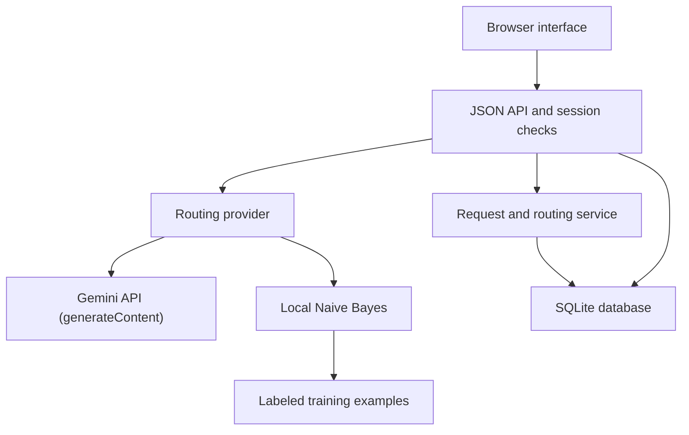
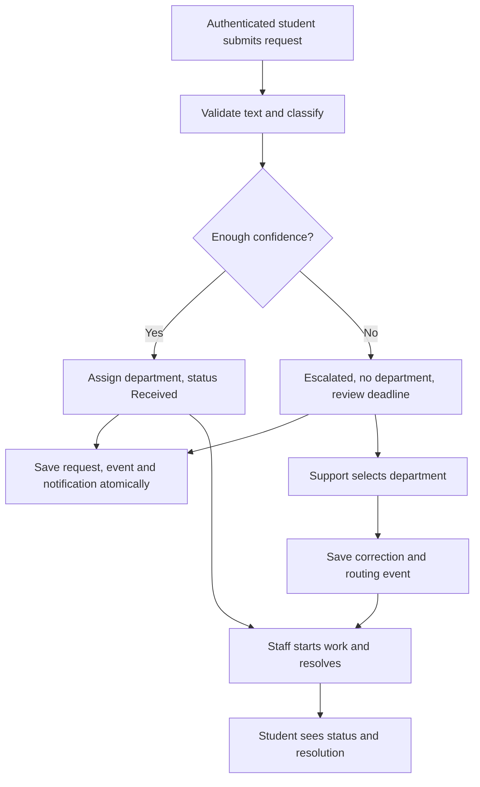
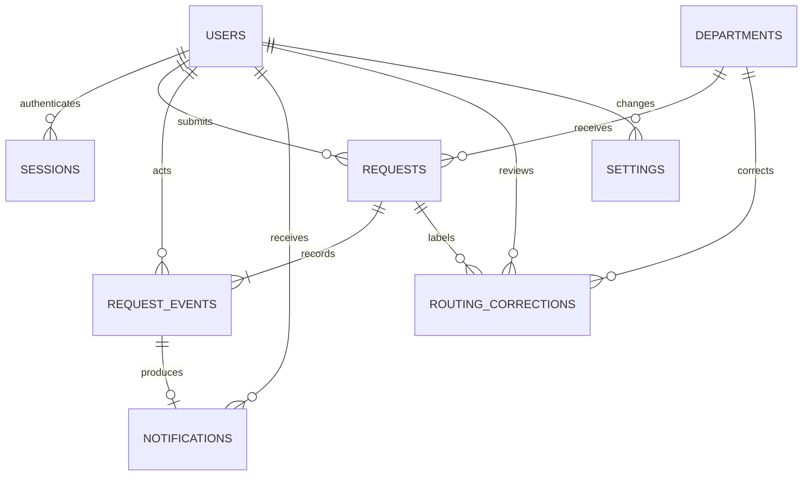
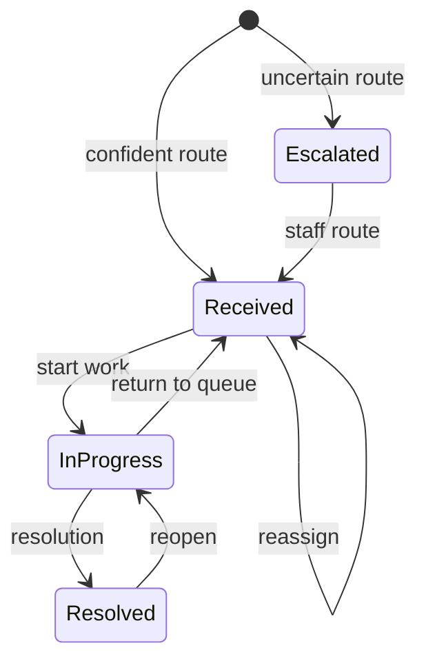

# Design and architecture

## Component responsibilities

The browser renders three role-specific workspaces. `Application` serves static files and validates JSON requests. The API validates and classifies before opening the write transaction. The service then saves routing, notifications, history and status atomically. SQLite retains the same eight entities. A provider abstraction selects Gemini API or the local trained model.

## Request flow

## ER diagram

## Data dictionary

| Entity | Important fields | Purpose |
| --- | --- | --- |
| users | name, unique email, password_hash, role | Student/support/admin identities |
| sessions | token_hash, nullable user_id, csrf_token, expires_at | Anonymous/authenticated sessions; cookie token hashed in DB |
| departments | code, name, response_hours | Four configured destinations and response estimates |
| requests | student_id, original message, department_id, confidence, classification_json, status, priority, version, timestamps, review_due_at | Request and current routing/state |
| request_events | request_id, actor_id, kind, status, detail, version, created_at | Student-visible chronological history |
| notifications | user_id, request_id, unique event_id, message, read_at | One in-app notice per event |
| routing_corrections | request_id, staff_id, original/corrected code, confidence, message_snapshot, reason | Labels for future retraining |
| settings | key, value, updated_by, updated_at | Persisted confidence threshold |

The SQLite schema enforces role/status/priority enums and foreign keys. An escalated request has no department; every other status has an assigned department. Notifications/events/corrections cascade when a student deletes a request before work begins. Operational deployments need an institutional retention policy; the prototype's early deletion behavior is deliberate CRUD.

## State transitions

The API serializes `InProgress` as `In Progress`. Editing a request before work starts runs classification again; it can move between Received and Escalated. A resolved request cannot be rerouted until reopened. Student edit/delete is allowed only before staff starts work.

## Concurrency and consistency

For request creation/editing, authentication, input validation and AI classification run first. External HTTP work never holds the SQLite write lock. The API then begins `BEGIN IMMEDIATE`, rechecks the session, and reads the current request/version again before writing. Other mutations also begin the write transaction before final version checks. A client supplies the last seen request `version`; a stale version produces HTTP 409. This avoids overwriting another staff decision. Events and notifications are saved in the same transaction as the updated request. The event uniqueness constraint and notification's unique `event_id` prevent duplicate event receipts. Refreshing is read-only.

## UI/UX plan

| Screen | Structure and user action |
| --- | --- |
| Sign-in/registration | Intro panel, labeled form, validation error, switch to student registration |
| Student workspace | Sidebar, account header, request counts, intake form, own request list |
| Request detail | Original text, current route/status, timestamps, resolution, timeline, early edit/delete |
| Notification history | Chronological receipts, response estimates, read markers |
| Support queue | Status/department/priority filters, oldest-first cards, confidence, direct route selector/button |
| Administrator | Threshold, provider/model status, local training count or pretrained-model label, staff decision summaries |

The functional screens serve as executable wireframes. Captured previews and actual browser-check status, when available, live in `docs/evidence/`. `static/style.css` defines the shared colors, cards, typography, responsive breakpoints, and focus states.

## Deployment boundary

`wsgiref` is a local development server, with a thread-per-request wrapper. The default host is loopback. No public deployment is part of this submission. Use a production WSGI server, HTTPS, identity verification, backups, and institution-approved data handling before collecting real student requests.

## Provider configuration

`app/llm.py` calls the fixed HTTPS Gemini `generateContent` endpoint with a server-only `x-goog-api-key` header and a JSON response schema. `app/config.py` reads only allowed settings without evaluation and respects existing environment variables. `setup_gemini_windows.bat` writes local `.env`; no credentials are committed. `--ai local` forces offline mode. Review fallback has confidence zero and no assigned department. The interface distinguishes configuration from a verified response. See `ai_explanation.md` and `../API_START_RU.md`.

## SDU identity policy

`app/university.py` owns the exact nine-digit student-address rule and academic-year computation. Public registration applies this policy on the server before inserting a student. Profile metadata is derived when returning users, so course is not a stale database column. No ninth table or schema migration is needed. The requested helpdesk address is provisioned with a support role; public signup cannot create staff. Known old demo identities migrate in place, preserving IDs and request ownership. Mailbox control and official enrollment are not verified; see `SDU_REGISTRATION.md`.
